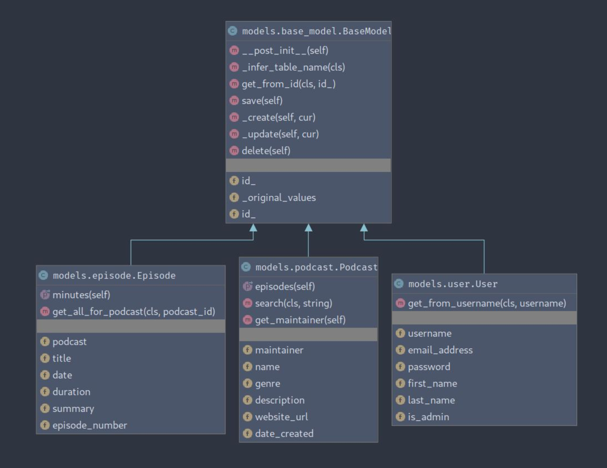

Code
====
BaseModel and Models
--------------------

Most of the database operations such as fetching, creating, updating or
deleting a row happens via the base model. Implementation wise, BaseModel and its
subclasses use dataclasses and depend on Python 3.7.

   Base Model

Model Definition
^^^^^^^^^^^^^^^^

When creating a model, developers must subclass the BaseModel, decorate with `dataclass`
and then add the attributes, mirroring the columns of the table:
   - same column names,
   - same column order,
   - same column types with type hinting, (as their psycopg2 types)

Because BaseModel infers the table name from class name, class names must be
singular forms of table names, written in CamelCase.

**Example Model:** 

   .. code-block:: python

      @dataclass
      class User(BaseModel):
      
         username: str
         email_address: str
         password: str
         first_name: str
         last_name: str
         is_admin: bool

Model Usage
^^^^^^^^^^^

Model methods change behaviour according to how they have been instantiated.
Models initialized with classic data class initialization are treated as
new entries in the table and the `save()` method will act as creation.
Models initialized with the `get_from_id()` *classmethod* are treated as
existing entries in the table and the `save()` method will act as update.
Calling `delete()` on an existing entry model will delete the row from database. 

BaseClass
^^^^^^^^^

.. py:class:: BaseClass(id_)

   .. py:classmethod:: get_from_id(cls, id_):
      Fetch existing row as model
      :raises NoEntryError:

