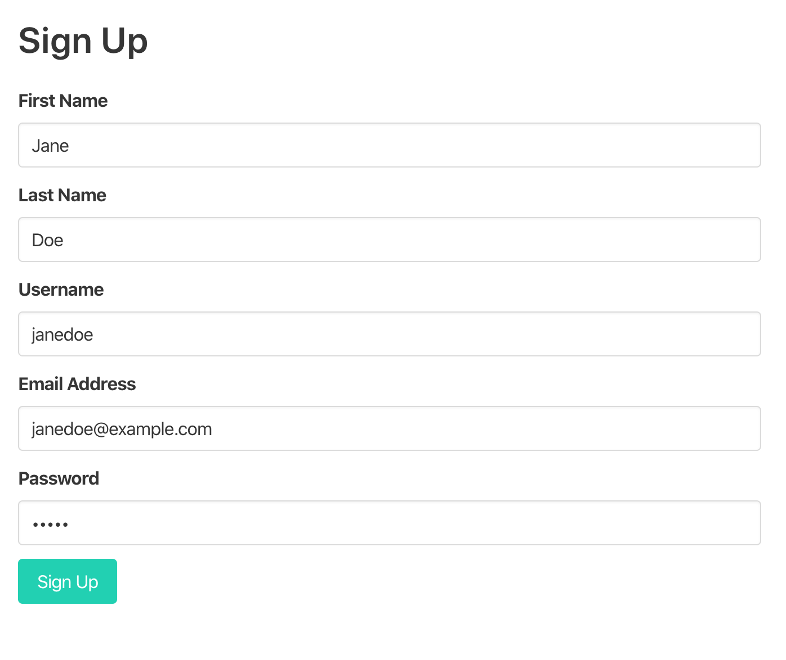
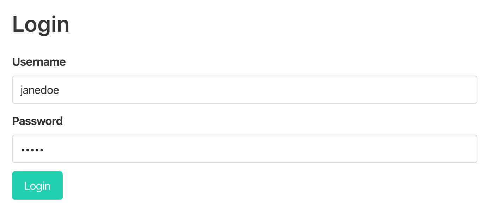
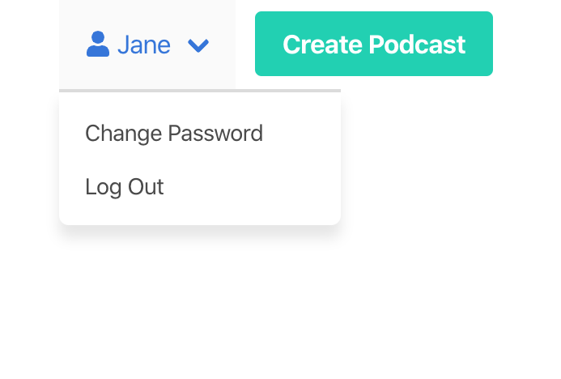
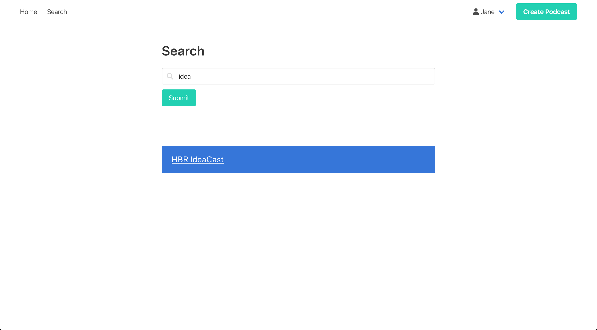
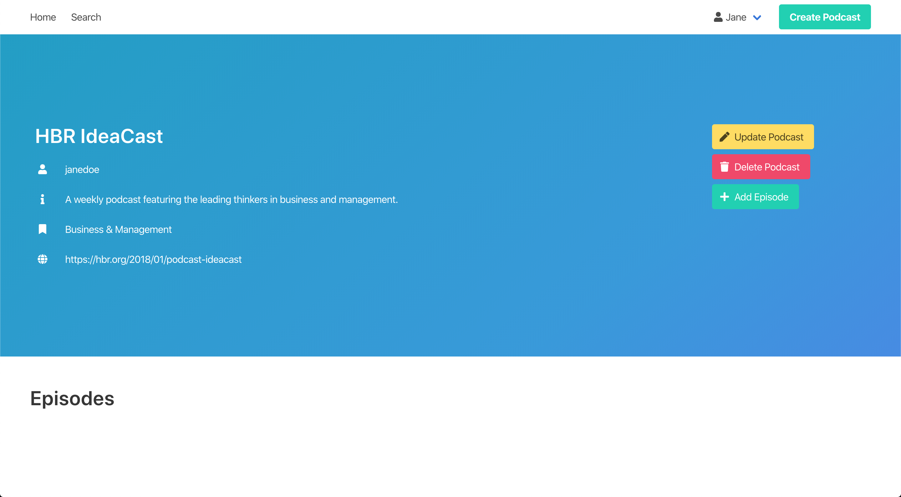
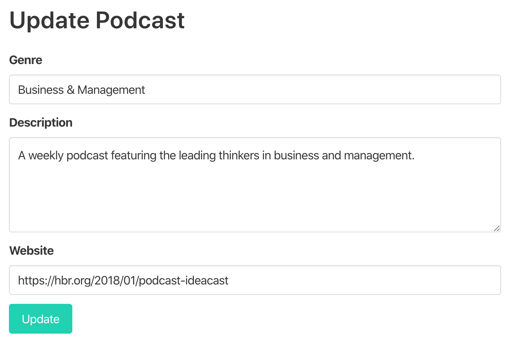
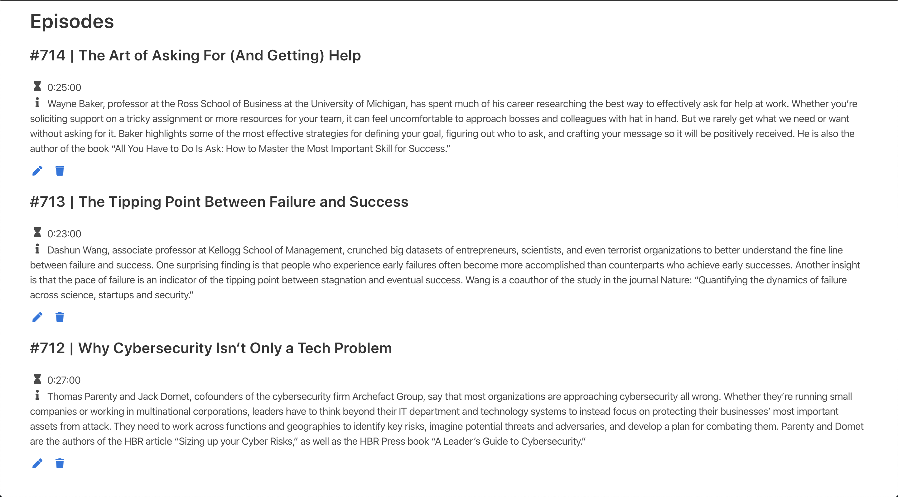

User Guide
==========

This page contains a quick summary of user actions such as,
    - Sign up and log in 
    - Search for podcasts
    - Create and maintain podcasts
    - Create and maintain podcast episodes

Sign up and log in 
-----
    
Users are registered members of Audiocasts community. They can be an admin or a regular user.

Registration is possible through the form below. 

	Sign Up Page

In order to create podcasts, users have to log in first. Users that are not logged in can only search and view podcasts and episodes. 

	Login page

When logged in, users will see their names appear on the top navigation bar, with a dropdown menu when clicked. Users can log out or change their passwords over the menu. 

	Change Password or Log Out

Create and maintain podcasts 
--------

In Audiocasts, everyone can search podcasts in the home page and view podcast and episode information. 

	Searching for podcasts

Anyone can view podcasts and its episodes. 

	Podcast view

**Once a podcast is created by its user, that user becomes the maintainer for that podcast and its episodes. Only maintainers and admins can edit or delete podcast information.**

Using the 'Update podcast' button, maintainers or admins can update the genre, description and website information of the relevant podcast. 

	Updating podcasts

Create and maintain podcast episodes 
--------

Since nearly all podcasts have episodes, Audiocasts also supports episode information in podcasts. Podcast maintainers and admins can add episodes to relevant podcasts.

.. figure:: images/viewpodwepis.png
   :align:   center

	Podcast view with episodes

Through the 'Add episode' button, podcast maintainers and admins can add episode by filling in title, duration, summary and episode number information. 

.. figure:: images/createepisode.png
   :align:   center

	Adding an episode

If maintainers decide to edit or delete episode information, maintainers will be shown hidden editing buttons, which only maintainers and admins can access the endpoint.

	Episodes view
   